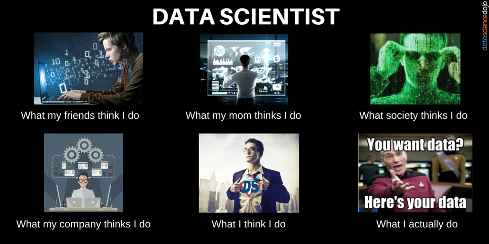
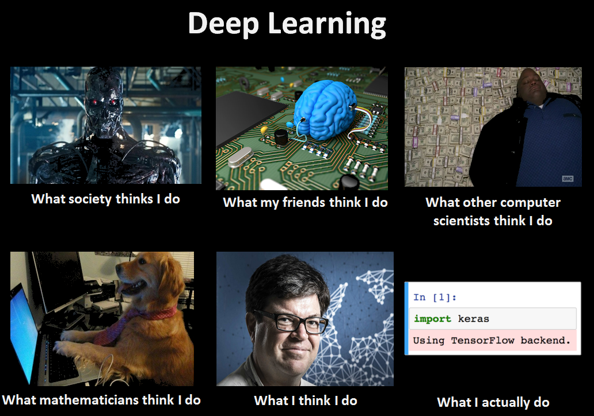

# Supervised Machine Learning

## Background

The intent of this exercise was to demonstrate what we have learned regarding Preprocessing Data, Considering Models, Scaling Data, and Scoring the Models we created.

## Observation

Scaling has a larger impact on the Logistic Regression model than the Random Forest Classifier model.  See markdowns for comparison information.

### What we are about to become...

*Image from Twitter*

### Where we are headed...

*Image from KDnuggets*
